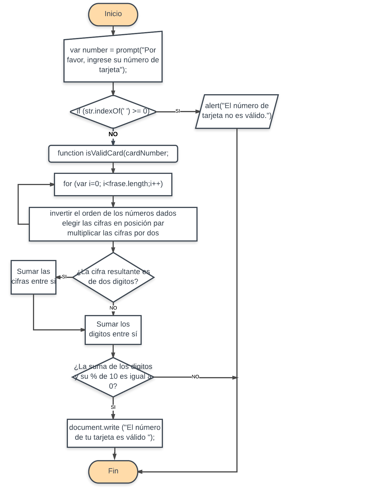

## Notas para Algoritmo Luhn
Crea una web que pida, por medio de un prompt(), el número de una tarjeta de crédito y confirme su validez según el algoritmo de Luhn.
Consideraciones Específicas
1. Tu código debe estar compuesto por 1 función: isValidCard
2. El usuario no debe poder ingresar un campo vacío

## Pseudocódigo para Algoritmo Luhm
1. Crear una función llamada isValidCard
2. Solicitar por medio de un prompt() el número de una tarjeta
3. Identificar si los caracteres son espacios o letras
4. En caso de que sean espacios o letras, enviar una alerta que diga que el usuario ingresó una tarjeta no valida.
5. En caso de que sean sólo números, asignar un número de posición a cada número.
6. Devolver el arreglo en orden inverso.
7. Multiplicar por dos, los números en posición impar (o indice impar).
8. Si al multiplicar dichos números el resultado es mayor o igual a 10, sumar ambos dígitos para obtener un número de una cifra.
9. Sumar todos los números resultantes.
10. Si el resultado de la suma y su módulo de 10 (%10) es igual a cero, la tarjeta es válida, de lo contrario es inválida.

## Diagrama de flujo
A continuación se incluye el diagrama de flujo

